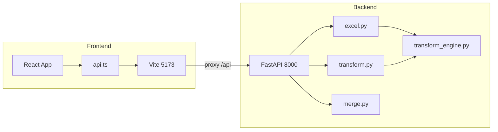

# Case_Study Project – Complete Overview for Claude

This document gives another AI (e.g. Claude) or a developer everything needed to understand the project: purpose, architecture, what was done, current status, issues and fixes, and technical details.

---

## 1. What This Project Is

**Excel Data Transformation Tool** – A full-stack web app for non-technical users to:

- Upload Excel (`.xlsx`) files
- Preview sheets and detect headers
- Build a **pipeline of operations** (filter, replace, math, sort, select columns, net profit, etc.)
- Validate the pipeline, preview results, and download transformed Excel or ZIP (including batch)

The app is **multi-page**: Landing → Upload → Preview → Pipeline (configure operations) → Results; plus **Batch** and **Merge** modes.

---

## 2. Tech Stack and Architecture

| Layer | Tech | Purpose |

|-------|------|--------|

| Frontend | React 18, TypeScript, Vite 5 | SPA, dev server on port 5173 |

| Frontend UI | Tailwind CSS, shadcn/ui (Radix), lucide-react | Styling and components |

| Frontend state/routing | React Router 6, AppContext | Pages and shared state (fileId, sheetName, operations, etc.) |

| Backend | Python 3.9+, FastAPI, uvicorn | API on port 8000 |

| Backend data | pandas, openpyxl | Excel load/save and transformations |

| Backend models | Pydantic | Request/response and operation validation |

**Request flow:** Browser → Vite dev server (5173) → proxy `/api` to backend (8000) → FastAPI → [excel.py, transform.py, merge.py] → transform_engine.py + operations.py.

---

## 3. Project Structure (Key Paths)

- **Root:** [package.json](package.json) – `npm start` runs backend + frontend via `concurrently`; [scripts/start-backend.js](scripts/start-backend.js) spawns backend venv’s uvicorn.
- **Backend:** [backend/app/main.py](backend/app/main.py) – FastAPI app, CORS, lifespan (file storage rebuild, cleanup); [backend/app/transform_engine.py](backend/app/transform_engine.py) – all `validate_*` / `apply_*` for each operation type; [backend/app/models/operations.py](backend/app/models/operations.py) – Pydantic operation models; [backend/app/api/v1/](backend/app/api/v1/) – excel.py, transform.py, merge.py, health.py.
- **Frontend:** [frontend/src/App.tsx](frontend/src/App.tsx) – Routes; [frontend/src/context/AppContext.tsx](frontend/src/context/AppContext.tsx) – global state; [frontend/src/lib/api.ts](frontend/src/lib/api.ts) – axios client and types; [frontend/src/pages/](frontend/src/pages/) – LandingPage, UploadPage, PreviewPage, PipelinePage, ResultsPage, BatchPage, MergePage; [frontend/src/components/PipelineBuilder.tsx](frontend/src/components/PipelineBuilder.tsx) – pipeline UI, validate/run, validation result card.
- **Run scripts:** [run-all.ps1](run-all.ps1), [start-backend.ps1](start-backend.ps1), [start-frontend.ps1](start-frontend.ps1); [START-HERE.md](START-HERE.md) – run instructions.

---

## 4. API Endpoints (Summary)

| Method | Path | Purpose |

|--------|------|--------|

| GET | /api/v1/health | Health check |

| POST | /api/v1/upload-excel | Upload file, get fileId, sheets |

| POST | /api/v1/upload-multiple-excel | Multi-file upload |

| GET | /api/v1/preview-sheet | Preview rows (fileId, sheetName, limit, headerRowIndex) |

| POST | /api/v1/validate-pipeline | Validate pipeline (fileId, sheetName, operations) → ok + errors[] |

| POST | /api/v1/preview-transform | Run pipeline, return preview data + metadata |

| POST | /api/v1/export-transform | Export transformed sheet as Excel |

| POST | /api/v1/batch-transform | Transform multiple files/sheets; optional ZIP |

| GET | /api/v1/download-batch-zip | Download batch ZIP |

| GET | /api/v1/download-transformed | Download single transformed file |

| POST | /api/v1/merge-files | Merge files (append/join/union) |

---

## 5. Operation Types (Backend + Frontend)

Supported in [backend/app/transform_engine.py](backend/app/transform_engine.py) and [backend/app/models/operations.py](backend/app/models/operations.py); frontend types in [frontend/src/lib/api.ts](frontend/src/lib/api.ts).

- **filter** – column, operator (equals, not_equals, greater_than, less_than, contains, etc.), value
- **replace** – column, oldValue, newValue
- **math** – operation (add/subtract/multiply/divide), colA, colBOrValue, newColumn
- **sort** – columns (column + ascending)
- **select_columns** – columns[]
- **remove_duplicates** – optional subset, keep
- **aggregate** – groupBy, aggregations
- **text_cleanup** – column, operations[]
- **split_column** – column, separator, newColumns[]
- **merge_columns** – columns[], newColumn, optional separator
- **date_format** – column, outputFormat
- **remove_blank_rows** – optional columns
- **convert_to_numeric** – column, errors
- **gross_profit** – revenueColumn, costOfGoodsSoldColumn, newColumn
- **net_profit** – grossProfitColumn, expensesColumn, newColumn
- **profit_loss** – dateColumn, revenueColumn, costColumn, period (monthly/quarterly), newColumns

---

## 6. What Was Done (Phases and Features)

- **Phase 1:** Project setup, upload Excel, preview sheets, file storage (UUID), basic errors.
- **Phase 2:** Transformation engine (filter, replace, math), Pydantic models, preview-transform endpoint.
- **Phase 2.5:** Excel loader with header detection, ColumnNotFoundError, headerRowIndex support.
- **Phase 3:** Operation IDs, validation helpers, validate-pipeline endpoint, logging, OperationValidationError.
- **Phase 3.5:** Pipeline Builder UI – add/edit/reorder/delete operations, validate + run & preview.
- **Phase 4 (partial):** Export, batch transform, merge, pipeline in batch mode; multi-page UX (Landing, Upload, Preview, Pipeline, Results, Batch, Merge).

**Current feature set:** Upload (single/multi), sheet preview with header detection, pipeline builder with all operation types above, validate pipeline, run & preview, export transformed Excel, batch transform with ZIP, merge files. Error boundaries and structured API errors on frontend.

---

## 7. Current Status

- **Phases 1–3.5 and Phase 4 (export/batch/merge/multi-page):** Implemented and working.
- **Remaining (per README):** Phase 4 polish, tests, possible future items (data quality reports, templates, undo/redo, export pipeline as JSON).
- **Run:** From project root, `npm install` then `npm start` (ensures backend venv exists first; see [START-HERE.md](START-HERE.md)). Backend: 8000, Frontend: 5173; leave terminal open.

---

## 8. Issues Encountered and Fixes Applied

**1) ERR_CONNECTION_REFUSED (localhost:5173)**

- **Cause:** Frontend (and/or backend) not running; user had to start two processes and sometimes forgot or closed terminals.  
- **Fixes:**  
  - Root [package.json](package.json) with `npm start` using `concurrently` to run backend + frontend in one terminal.  
  - [scripts/start-backend.js](scripts/start-backend.js) to start backend venv’s uvicorn cross-platform.  
  - [run-all.ps1](run-all.ps1) improved (create `.cursor` if needed, `-WorkingDirectory` for child processes).  
  - [START-HERE.md](START-HERE.md) and README updated: Option 0 = `npm start` from root; Options 1–3 = two windows/terminals/manual.

**2) “ArrowUp is not defined” / “Edit is not defined”**

- **Cause:** [PipelineBuilder.tsx](frontend/src/components/PipelineBuilder.tsx) used lucide-react icons `ArrowUp`, `ArrowDown`, `Edit`, `Trash2` without importing them.  
- **Fix:** Added `ArrowUp`, `ArrowDown`, `Edit`, `Trash2` to the lucide-react import in PipelineBuilder.tsx.

**3) Blank white screen after adding Net Profit and clicking “Validate Pipeline”**

- **Causes:**  
  - **Backend:** `validate_operations()` only validated each step against the **current** dataframe and never applied successful steps. So when Net Profit ran after Gross Profit, the “Gross Profit” column didn’t exist in the validation dataframe.  
  - **Frontend:** Validation result assumed `result.ok`, `result.errors` array, and each `err` with `opIndex`/`opType`/`message`; missing or malformed data could throw during render and show a blank screen.  
- **Fixes:**  
  - **Backend ([transform_engine.py](backend/app/transform_engine.py)):** After each successful validation, the operation is applied to `result_df` so later operations (e.g. net_profit) see new columns (e.g. Gross Profit). `OperationValidationError` from `apply_operations` is caught and converted to the same error dict format.  
  - **Frontend ([PipelineBuilder.tsx](frontend/src/components/PipelineBuilder.tsx)):** Validation state set only when response has `ok` (boolean) and `errors` (array); safe fallbacks for `opIndex`/`opType`/`message` when building messages and rendering the validation card; in catch, `onError` is always given a string (e.g. `JSON.stringify` if detail is an object) so the UI never crashes on non-string error payloads.

---

## 9. Data Flow (High Level)

1. **Upload:** User uploads file(s) → POST upload-excel (or upload-multiple-excel) → backend stores file, returns fileId + sheets → frontend stores fileId/sheets in context and can navigate to Preview.
2. **Preview:** Frontend calls GET preview-sheet (fileId, sheetName, limit, optional headerRowIndex) → backend loads Excel with header detection → returns columns, rows, optional headerRowIndex/warning → frontend shows table and can go to Pipeline.
3. **Pipeline:** User adds/edits/reorders operations → “Validate Pipeline” → POST validate-pipeline → backend runs `validate_operations()` (validates and simulates apply so dependent columns exist) → returns ok + errors[] → frontend shows green/red card and error list; “Run & Preview” → POST preview-transform → backend runs `apply_operations()` → returns transformed columns/rows and metadata → frontend shows results and can export.
4. **Export:** POST export-transform or GET download-transformed → backend writes Excel to outputs and returns file or URL → frontend triggers download.
5. **Batch/Merge:** Batch: multiple fileIds + sheetName + operations → batch-transform (optional ZIP). Merge: fileIds + strategy (append/join/union) → merge-files → merged fileId for further use.

---

## 10. Important Conventions for Claude

- **Backend operation params** use camelCase in API (e.g. `grossProfitColumn`, `newColumn`); Pydantic models in operations.py match.
- **Frontend** keeps operations in state with `id`, `type`, `params`, and derived `summary`; when calling API, `id` and `summary` are stripped and only `type` + `params` sent.
- **Validation:** validate-pipeline is “dry run” that validates and simulates application so column dependencies (e.g. Gross Profit before Net Profit) are satisfied; it does not persist data.
- **File storage:** Backend stores uploads under `uploads/` and outputs under `outputs/`; lifespan rebuilds in-memory file index from disk and runs periodic cleanup for outputs.
- **Single command run:** Prefer `npm start` from project root; ensure `backend/venv` exists and `pip install -r requirements.txt` has been run once.

---

## 11. Where to Look for Specific Things

| Need | Location |

|------|----------|

| Add new operation type | Backend: transform_engine.py (validate_ *+ apply_*), models/operations.py (Pydantic model). Frontend: api.ts (Operation type), PipelineBuilder/operationsConfig.tsx, OperationConfigDialog.tsx (defaults + form), PipelineBuilder.tsx (e.g. net_profit in operation type list). |

| Change API contract | Backend: api/v1/*.py, models/operations.py. Frontend: lib/api.ts (types + excelApi methods). |

| Fix “connection refused” | Ensure both servers run (npm start or START-HERE.md). |

| Fix “X is not defined” in UI | Check lucide-react (or other) imports in the component that uses X. |

| Validation / blank screen after validate | Backend: validate_operations() must simulate applying ops so later ops see new columns. Frontend: validation result handling must be defensive (array checks, safe property access, string-only onError). |

This overview should be enough for Claude to understand the project, its status, past issues, and where to change or extend behavior.